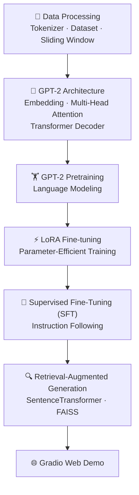

🌐 Language
- 🇺🇸 English (Current)
- 🇨🇳 [简体中文](README_zh.md)
# 🚀 Build a Large Language Model from Scratch (GPT-2)

<div align="center">

[](https://www.python.org/)
[](https://pytorch.org/)
[](https://developer.nvidia.com/cuda-zone)
[](LICENSE)

**A complete GPT-2 implementation from scratch with PyTorch, featuring LoRA, SFT, RAG and Gradio Demo.**

*Understand the internal principles of Large Language Models through end-to-end implementation.*

</div>

***

# ✨ Project Highlights

✅ GPT-2 (124M) implemented completely from scratch

✅ Pure PyTorch implementation (No HuggingFace Transformers)

✅ Multi-Head Self Attention

✅ Transformer Decoder Architecture

✅ LoRA Parameter-Efficient Fine-tuning

✅ Supervised Fine-Tuning (SFT)

✅ Retrieval-Augmented Generation (RAG)

✅ FAISS Vector Retrieval

✅ Gradio Web Demo

***

# 🏗 Architecture Overview



***

# 📌 Project Overview

This project implements **GPT-2 (124M)** completely from scratch using **PyTorch**, covering the entire workflow from **model construction** to **LLM application development**.

Unlike projects that simply call existing APIs, this repository focuses on understanding the internal mechanisms of Large Language Models by implementing every core component manually.

The project further extends GPT-2 with several mainstream LLM technologies:

- 🔹 LoRA (Low-Rank Adaptation)
- 🔹 Supervised Fine-Tuning (SFT)
- 🔹 Retrieval-Augmented Generation (RAG)
- 🔹 Gradio Interactive Web Demo

The repository provides a complete engineering pipeline covering:

> **Model Construction → Pretraining → Fine-tuning → Knowledge Enhancement → Application Deployment**

making it suitable for learning, research and engineering practice.

***

# 🎯 Features

| Module             | Description                                    |
| ------------------ | ---------------------------------------------- |
| 📄 Data Processing | Tokenizer, Dataset, Sliding Window Sampling    |
| 🧠 GPT-2           | Complete Decoder-only Transformer Architecture |
| ✨ Text Generation  | Temperature / Top-k / Top-p Sampling           |
| ⚡ LoRA             | Parameter-Efficient Fine-tuning                |
| 📝 SFT             | Instruction Fine-tuning                        |
| 🔍 RAG             | SentenceTransformer + FAISS                    |
| 🌐 Web Demo        | Gradio Interactive Interface                   |

***

# 📸 Demo

> **Coming Soon**

Gradio Web Interface

Training Loss Visualization

RAG Question Answering

Model Generation Examples

***

# 📂 Repository Structure

```text
build-a-LLM-from-scratch/

├── GPT-2 Architecture
├── LoRA Fine-tuning
├── Supervised Fine-tuning (SFT)
├── Retrieval-Augmented Generation
├── Gradio Demo
└── Utilities
```

***

# 📑 Table of Contents

- ✨ Features
- 💻 Installation
- 🚀 Quick Start
- 📁 Project Structure
- 🧠 GPT-2 Implementation
- ⚡ LoRA Fine-tuning
- 📝 SFT
- 🔍 RAG
- 📊 Results
- 🛣 Roadmap
- 📄 License

# 💻 Installation

## Requirements

- Python >= 3.13
- PyTorch >= 2.0
- CUDA >= 11.8 (Optional, recommended)
- Git

***

## Clone Repository

```bash
git clone https://github.com/LONG2622/build-a-LLM-from-scratch.git
cd build-a-LLM-from-scratch
```

***

## Create Virtual Environment

### Using uv (Recommended)

```bash
pip install uv

uv venv .venv --python=3.13

# Windows
.venv\Scripts\Activate.ps1

# Linux / macOS
source .venv/bin/activate
```

### Using Conda

```bash
conda create -n llm python=3.13

conda activate llm
```

***

## Install Dependencies

### CUDA Version

```bash
pip install torch torchvision torchaudio \
--index-url https://download.pytorch.org/whl/cu118
```

### CPU Version

```bash
pip install torch torchvision torchaudio
```

Install other dependencies

```bash
pip install -r requirements.txt
```

***

## Download GPT-2 Weights (Optional)

```bash
python gpt_download.py
```

Or manually download pretrained weights from

<https://huggingface.co/gpt2>

and place them under

```text
gpt2_pretrained/
```

***

# 🚀 Quick Start

Run each module independently.

## GPT-2 Inference

```bash
python ch03.py
```

***

## LoRA Fine-tuning

```bash
python lora.py
```

***

## Supervised Fine-tuning

```bash
python sft_finetune.py
```

***

## Retrieval-Augmented Generation

```bash
python RAG.py
```

If downloading models from China, configure the HuggingFace mirror.

Windows

```powershell
set HF_ENDPOINT=https://hf-mirror.com
python RAG.py
```

Linux / macOS

```bash
export HF_ENDPOINT=https://hf-mirror.com
python RAG.py
```

***

## Launch Web Demo

```bash
python web_demo.py
```

Open your browser:

```text
http://127.0.0.1:7860
```

***

# 📂 Project Structure

```text
build-a-LLM-from-scratch/

├── data_preprocessing.py      # Tokenization & Dataset
├── attention.py               # Multi-Head Self Attention
├── gpt_model.py               # GPT-2 Architecture
├── pretrain_trainer.py        # GPT Pretraining
├── classification_finetune.py # Classification Task
├── instruction_finetune.py    # Instruction Tuning
├── lora_adapter.py            # LoRA
├── sft_finetune.py            # Supervised Fine-Tuning
├── RAG.py                     # Retrieval-Augmented Generation
├── web_demo.py                # Gradio Demo
├── config.py
├── config_clean.py
├── requirements.txt
└── README.md
```

***

# 📖 Learning Path

This repository is organized progressively.

| Step | Content                        |
| ---- | ------------------------------ |
| ①    | Data Processing & Tokenization |
| ②    | Multi-Head Self Attention      |
| ③    | GPT-2 Architecture             |
| ④    | GPT Pretraining                |
| ⑤    | LoRA Fine-tuning               |
| ⑥    | Supervised Fine-tuning         |
| ⑦    | Retrieval-Augmented Generation |
| ⑧    | Gradio Deployment              |

Following the above order helps understand the complete workflow of modern Large Language Models.
# 🧠 GPT-2 Implementation

Unlike projects that rely on high-level libraries, this repository implements GPT-2 almost entirely from scratch using **native PyTorch**.

The implementation includes every core component of the Transformer decoder architecture.

## Implemented Modules

- Token Embedding
- Positional Embedding
- Multi-Head Self Attention
- Causal Attention Mask
- Feed Forward Network (FFN)
- Layer Normalization
- Residual Connections
- Dropout
- GPT Decoder Blocks
- Language Modeling Head

The model follows the original GPT-2 architecture with configurable parameters.

```python
GPT_CONFIG_124M = {
    "vocab_size": 50257,
    "context_length": 1024,
    "emb_dim": 768,
    "n_heads": 12,
    "n_layers": 12,
    "drop_rate": 0.1,
    "qkv_bias": False
}
```

---

# ⚡ LoRA Fine-tuning

To reduce GPU memory consumption and training cost, the project implements **Low-Rank Adaptation (LoRA)**.

Instead of updating the original weight matrices, LoRA introduces two trainable low-rank matrices while freezing the pretrained model parameters.

### Features

- Parameter-Efficient Fine-tuning
- Frozen Backbone
- Low GPU Memory Usage
- Easy Integration into GPT-2

Typical configuration:

```python
lora_rank = 8
lora_alpha = 8
lora_dropout = 0.0
```

---

# 📝 Supervised Fine-Tuning (SFT)

The project further supports instruction tuning through supervised learning.

Implemented features include:

- Instruction Dataset Formatting
- Prompt-Response Training
- Loss Masking
- Teacher Forcing
- Cross Entropy Optimization

The SFT pipeline enables GPT-2 to follow user instructions more effectively.

---

# 🔍 Retrieval-Augmented Generation (RAG)

The repository also implements a lightweight Retrieval-Augmented Generation pipeline.

Workflow:

```text
Knowledge Documents
        │
        ▼
Text Chunking
        │
        ▼
Sentence Embedding
        │
        ▼
FAISS Vector Database
        │
        ▼
Top-k Retrieval
        │
        ▼
Prompt Augmentation
        │
        ▼
GPT-2 Generation
```

Main components:

- Document Chunking
- SentenceTransformer Embedding
- FAISS Vector Index
- Similarity Search
- Prompt Construction

This allows GPT-2 to answer questions using external knowledge without retraining.

---

# 🌐 Web Demo

A Gradio-based web interface is provided for interactive inference.

Current features include:

- Adjustable Generation Parameters
- Interactive Chat Interface
- RAG-based Question Answering
- Real-time Model Inference

Simply launch

```bash
python web_demo.py
```

and open

```text
http://127.0.0.1:7860
```

in your browser.

---

# 📈 Project Highlights

Compared with many educational implementations, this project extends GPT-2 beyond the original model and provides a complete LLM engineering workflow.

| Capability | Supported |
|------------|-----------|
| GPT-2 From Scratch | ✅ |
| Multi-Head Attention | ✅ |
| Text Generation | ✅ |
| Pretraining | ✅ |
| LoRA Fine-tuning | ✅ |
| SFT | ✅ |
| RAG | ✅ |
| FAISS Retrieval | ✅ |
| Web Demo | ✅ |

---

# 📊 Results

The project has been successfully tested on the following tasks:

- GPT-2 Text Generation
- LoRA Fine-tuning
- Instruction Following
- SMS Spam Classification
- Retrieval-Augmented QA
- Interactive Web Demo

Example outputs and screenshots will be added in future updates.