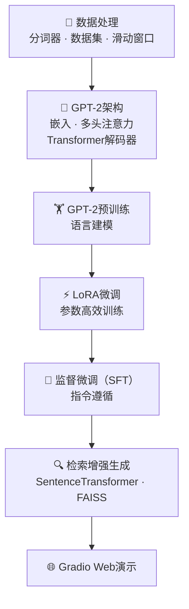

🌐 语言
- 🇨🇳 简体中文（当前）
- 🇺🇸 [English](README.md)
# 🚀 从零构建大语言模型（GPT-2）

<div align="center">

[](https://www.python.org/)
[](https://pytorch.org/)
[](https://developer.nvidia.com/cuda-zone)
[](LICENSE)

**基于PyTorch从零实现完整的GPT-2，包含LoRA、SFT、RAG和Gradio演示。**

*通过端到端实现理解大语言模型的内部原理。*

</div>

***

# ✨ 项目亮点

✅ 从零完整实现GPT-2（124M）

✅ 纯PyTorch实现（不依赖HuggingFace Transformers）

✅ 多头自注意力机制

✅ Transformer解码器架构

✅ LoRA参数高效微调

✅ 监督微调（SFT）

✅ 检索增强生成（RAG）

✅ FAISS向量检索

✅ Gradio Web演示

***

# 🏗 架构概览



***

# 📌 项目简介

本项目使用**PyTorch**从零实现**GPT-2（124M）**，涵盖从**模型构建**到**大模型应用开发**的完整工作流程。

与简单调用现有API的项目不同，本仓库专注于通过手动实现每个核心组件来理解大语言模型的内部机制。

项目进一步扩展了GPT-2，集成了多种主流大模型技术：

- 🔹 LoRA（低秩适应）
- 🔹 监督微调（SFT）
- 🔹 检索增强生成（RAG）
- 🔹 Gradio交互式Web演示

本仓库提供完整的工程化流程，涵盖：

> **模型构建 → 预训练 → 微调 → 知识增强 → 应用部署**

适用于学习、研究和工程实践。

***

# 🎯 功能特性

| 模块       | 描述                          |
| :------- | :-------------------------- |
| 📄 数据处理  | 分词器、数据集、滑动窗口采样              |
| 🧠 GPT-2 | 完整的解码器Transformer架构         |
| ✨ 文本生成   | 温度采样 / Top-k / Top-p采样      |
| ⚡ LoRA   | 参数高效微调                      |
| 📝 SFT   | 指令微调                        |
| 🔍 RAG   | SentenceTransformer + FAISS |
| 🌐 Web演示 | Gradio交互式界面                 |

***

# 📸 演示

> **即将推出**

Gradio Web界面

训练损失可视化

RAG问答

模型生成示例

***

# 📂 仓库结构

```text
build-a-LLM-from-scratch/

├── GPT-2架构
├── LoRA微调
├── 监督微调（SFT）
├── 检索增强生成
├── Gradio演示
└── 工具类
```

***

# 📑 目录

- ✨ 功能特性
- 💻 安装
- 🚀 快速开始
- 📁 项目结构
- 🧠 GPT-2实现
- ⚡ LoRA微调
- 📝 SFT
- 🔍 RAG
- 📊 结果
- 🛣 路线图
- 📄 许可证

# 💻 安装

## 要求

- Python >= 3.13
- PyTorch >= 2.0
- CUDA >= 11.8（可选，推荐）
- Git

***

## 克隆仓库

```bash
git clone https://github.com/LONG2622/build-a-LLM-from-scratch.git
cd build-a-LLM-from-scratch
```

***

## 创建虚拟环境

### 使用 uv（推荐）

```bash
pip install uv

uv venv .venv --python=3.13

# Windows
.venv\Scripts\Activate.ps1

# Linux / macOS
source .venv/bin/activate
```

### 使用 Conda

```bash
conda create -n llm python=3.13

conda activate llm
```

***

## 安装依赖

### CUDA版本

```bash
pip install torch torchvision torchaudio \
--index-url https://download.pytorch.org/whl/cu118
```

### CPU版本

```bash
pip install torch torchvision torchaudio
```

安装其他依赖

```bash
pip install -r requirements.txt
```

***

## 下载GPT-2权重（可选）

```bash
python gpt_download.py
```

或手动从以下地址下载预训练权重

<https://huggingface.co/gpt2>

并放置在

```text
gpt2_pretrained/
```

***

# 🚀 快速开始

独立运行每个模块。

## GPT-2推理

```bash
python ch03.py
```

***

## LoRA微调

```bash
python lora.py
```

***

## 监督微调

```bash
python sft_finetune.py
```

***

## 检索增强生成

```bash
python RAG.py
```

如果在中国下载模型，请配置HuggingFace镜像。

Windows

```powershell
set HF_ENDPOINT=https://hf-mirror.com
python RAG.py
```

Linux / macOS

```bash
export HF_ENDPOINT=https://hf-mirror.com
python RAG.py
```

***

## 启动Web演示

```bash
python web_demo.py
```

打开浏览器：

```text
http://127.0.0.1:7860
```

***

# 📂 项目结构

```text
build-a-LLM-from-scratch/

├── data_preprocessing.py      # 分词与数据集
├── attention.py               # 多头自注意力
├── gpt_model.py               # GPT-2架构
├── pretrain_trainer.py        # GPT预训练
├── classification_finetune.py # 分类任务
├── instruction_finetune.py    # 指令微调
├── lora_adapter.py            # LoRA
├── sft_finetune.py            # 监督微调
├── RAG.py                     # 检索增强生成
├── web_demo.py                # Gradio演示
├── config.py
├── config_clean.py
├── requirements.txt
└── README.md
```

***

# 📖 学习路径

本仓库按循序渐进的方式组织。

| 步骤 | 内容       |
| :- | :------- |
| ①  | 数据处理与分词  |
| ②  | 多头自注意力   |
| ③  | GPT-2架构  |
| ④  | GPT预训练   |
| ⑤  | LoRA微调   |
| ⑥  | 监督微调     |
| ⑦  | 检索增强生成   |
| ⑧  | Gradio部署 |

按照上述顺序学习有助于理解现代大语言模型的完整工作流程。

# 🧠 GPT-2实现

与依赖高级库的项目不同，本仓库几乎完全使用**原生PyTorch**从零实现GPT-2。

实现包括Transformer解码器架构的每个核心组件。

## 已实现模块

- Token嵌入
- 位置嵌入
- 多头自注意力
- 因果注意力掩码
- 前馈网络（FFN）
- 层归一化
- 残差连接
- Dropout
- GPT解码器块
- 语言建模头

模型遵循原始GPT-2架构，参数可配置。

```python
GPT_CONFIG_124M = {
    "vocab_size": 50257,
    "context_length": 1024,
    "emb_dim": 768,
    "n_heads": 12,
    "n_layers": 12,
    "drop_rate": 0.1,
    "qkv_bias": False
}
```

***

# ⚡ LoRA微调

为了减少GPU内存消耗和训练成本，项目实现了**低秩适应（LoRA）**。

LoRA不更新原始权重矩阵，而是引入两个可训练的低秩矩阵，同时冻结预训练模型参数。

### 特性

- 参数高效微调
- 冻结骨干网络
- 低GPU内存占用
- 易于集成到GPT-2

典型配置：

```python
lora_rank = 8
lora_alpha = 8
lora_dropout = 0.0
```

***

# 📝 监督微调（SFT）

项目进一步支持通过监督学习进行指令微调。

已实现功能包括：

- 指令数据集格式化
- 提示-响应训练
- 损失掩码
- 教师强制
- 交叉熵优化

SFT流水线使GPT-2能够更有效地遵循用户指令。

***

# 🔍 检索增强生成（RAG）

仓库还实现了轻量级的检索增强生成流水线。

工作流程：

```text
知识文档
        │
        ▼
文本分块
        │
        ▼
句子嵌入
        │
        ▼
FAISS向量数据库
        │
        ▼
Top-k检索
        │
        ▼
提示词增强
        │
        ▼
GPT-2生成
```

主要组件：

- 文档分块
- SentenceTransformer嵌入
- FAISS向量索引
- 相似度搜索
- 提示词构建

这允许GPT-2在不重新训练的情况下使用外部知识回答问题。

***

# 🌐 Web演示

提供基于Gradio的Web界面用于交互式推理。

当前功能包括：

- 可调生成参数
- 交互式聊天界面
- 基于RAG的问答
- 实时模型推理

只需启动

```bash
python web_demo.py
```

然后在浏览器中打开

```text
http://127.0.0.1:7860
```

***

# 📈 项目亮点

与许多教育性实现相比，本项目将GPT-2扩展到原始模型之外，并提供完整的大模型工程化工作流程。

| 能力        | 支持 |
| :-------- | :- |
| 从零实现GPT-2 | ✅  |
| 多头注意力     | ✅  |
| 文本生成      | ✅  |
| 预训练       | ✅  |
| LoRA微调    | ✅  |
| SFT       | ✅  |
| RAG       | ✅  |
| FAISS检索   | ✅  |
| Web演示     | ✅  |

***

# 📊 结果

项目已在以下任务上成功测试：

- GPT-2文本生成
- LoRA微调
- 指令遵循
- SMS垃圾短信分类
- 检索增强问答
- 交互式Web演示

示例输出和截图将在未来更新中添加。

